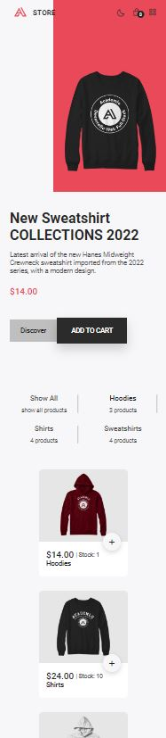
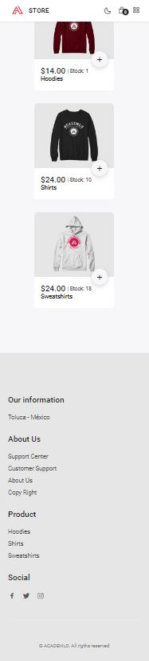
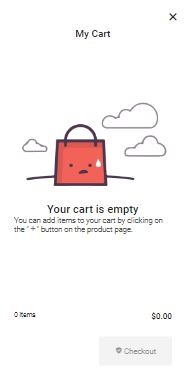
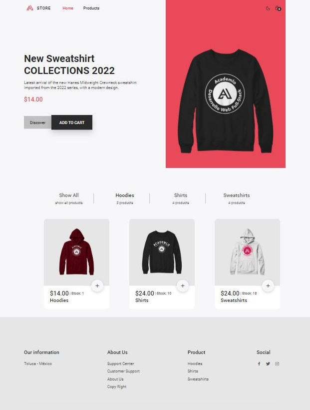
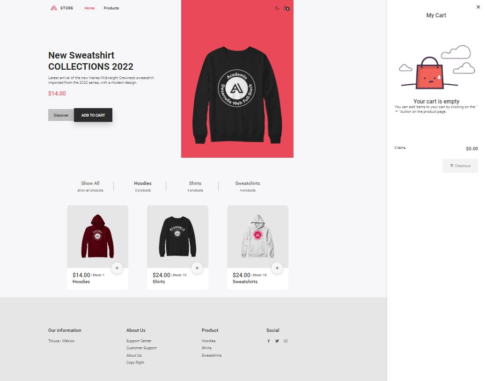
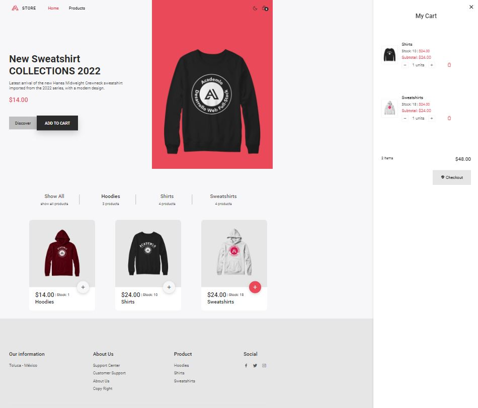
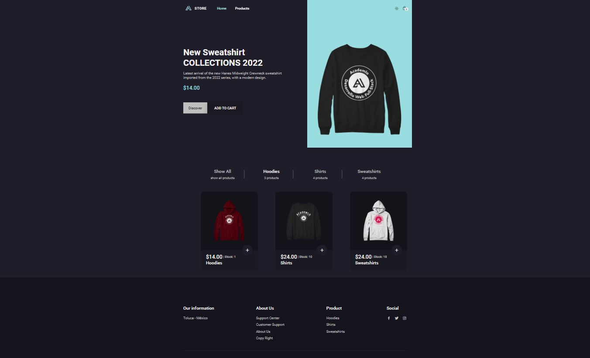
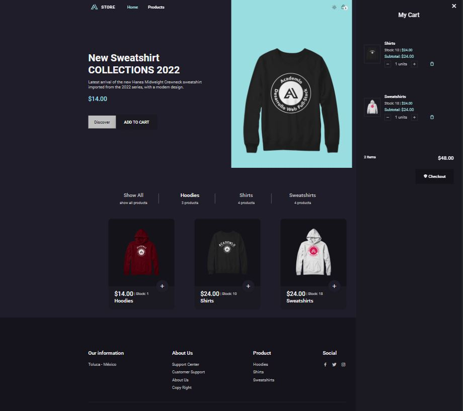

# Proyecto E-Commerce

Proyecto de [Academlo](https://www.academlo.com/) parte del bloque de fundamentos, en el cual se utiliza Vanilla JS en conjunto con HTML & CSS para la realización de la tienda electronica.

## Integrantes del Grupo:

* [José Argüelles Sandoval](https://github.com/josegerardo70mx)
* [Adelina Pelagio Juarez](https://github.com/Adepj)
* [Jonathan Mesach Venegas Santana](https://github.com/MesachVenegas)
* Lucero Camila González

## Mobile view

---

## Desktop View

---

